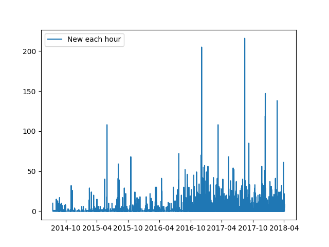

# facebook-archive
[](http://forthebadge.com) [](https://forthebadge.com)

[](https://girlscriptgssoc.slack.com/messages/CB4V6N62H/details/)

[](http://makeapullrequest.com) [](https://opensource.org/licenses/mit-license.php) 


 


> Analyse everything facebook knows about you, through their own archive.

In light of the recent facebook's data breach, Mark Zuckerberg made all the data available for each user via Facebook. You're going to need to download it, we'll get to it shortly. There are some things that would take a lot of time (too costly API calls) online, but can be easily done on archived data.

## Getting the data

1. Head on to [Facebook > Settings > General Settings](https://www.facebook.com/settings).
2. Select the JSON data format and click on download archive. It might take some time to prepare the archive, this might take upto 10-15 minutes. NOTE: The download might be in order of 100s MBs. (Mine was 634MB).
 

## Contributing

Your contributions are always welcome :smile: ! Please have a look at the [contribution guidelines](CONTRIBUTING.md) first.

Before working on an issue / feature, it is **crucial** that you're assigned the task on a GitHub issue.
* If a relevant issue already exists, discuss on the issue and get yourself assigned on GitHub.
* If no relevant issue exists, open a new issue and get it assigned to yourself on GitHub.
Please proceed with a Pull Request only after you're assigned. It'd be a waste of your time as well as ours if you have not contacted us before hand when working on some feature / issue.

If you are here for GirlScript's Summer of Code and wish to seek assistance, feel free to contact any of the mentors on [slack](https://girlscriptgssoc.slack.com/) - 
[@kaustubhhiware](https://girlscriptgssoc.slack.com/messages/DB0B3GBEG/), [@techytushar](https://girlscriptgssoc.slack.com/messages/DBBGEQAPQ/),
[@Anubhav](https://girlscriptgssoc.slack.com/messages/DBAK57AQ2/), [@fhackdroid](https://girlscriptgssoc.slack.com/messages/DBAK4TUP4/), [@Roopal](https://girlscriptgssoc.slack.com/messages/DB92S68SX).

## Features

### Your friends

* Plot the friends you make every day (blue), and the friends so far (orange).

 

* Plot exclusively the friends you make each day.

 

* Plot messages as a function of month.

 

### Messages

The following is available for either a specific chat (person / group) or for all messages.

* Plot all messages so far, with new messages each hour.

 

* Plot only new messages each hour.

 

* Plot messages as a function of hour (0-24)

 

* Plot messages as a function of month.

 

## Observations

1. There is a spike in friends made in March (Election season) and July (new juniors, much higher spike).

2. I tend to message less during exams (Feb, Apr, Sep, Nov).

3. Highest number of messages sent at 9 and 11 pm, confirming with calls from home come at 10pm. Almost no messages shared between 3am-7am.

## Usage

Install requirements with `pip install -r requirements.txt`

### Friends

```
> python plot_friends.py
Enter facebook archive extracted location: <location of extracted data folder,  e.g.: "facebook-kaustubhhiware">
```
You can also run the script on sample data included in the examples folder:
```python
> python plot_friends.py
Enter facebook archive extracted location: ./examples
```
### Messages

* Plot messages across all conversations.
 ```
 > python plot_messages.py -a
 Enter facebook archive extracted location: "location of extracted, downloaded zip: like facebook-kaustubhhiware" 
 ```

* Plot messages for a single conversation.
 ```
 > python plot_messages.py
 Enter facebook archive extracted location: "location of extracted, downloaded zip: like facebook-kaustubhhiware"
 Enter id for friend: 511
 ```

What's this id? 
1. Open index.html in `facebook-yourfacebookusername`
2. Click messages. Search for the person / conversation you want to analyse.
3. Clicking on that chat should open a url like ; 'file:///home/kaustubh/GitHub/facebook-kaustubhhiware/messages/511.html'. For this particular chat, 511 is the id for this particular conversation.

## Why

I always wanted to know how many friends I make every month. It would have been infeasible to make a webapp out of this because so many API calls would be so _slow_, and whosoever wants to work with Facebook's Graph API?

Plus it was raining and I couldn't go to MS's Hall Day till after the rain stopped.

Have a feature request? See an interesting avenue not utilised yet with facebook's archive? Let me know by making a new issue.

## ToDos

- [ ] Plot number of messages with each friend as a function of time. Since this could get messy, plot only top 10-20 friends.
 This way I'll know who're really my friends and who just pretend to be.
- [ ] Pick larger intervals to plot for clearer graphs, less shaky.

## License

The MIT License (MIT) 2018 - [Kaustubh Hiware](https://github.com/kaustubhhiware). Please have a look at the [LICENSE](LICENSE) for more details.
