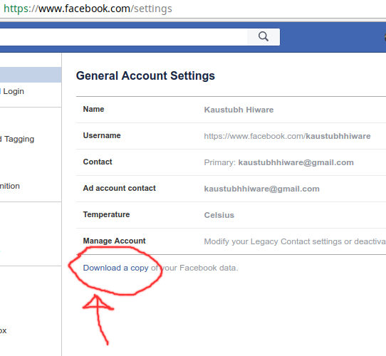
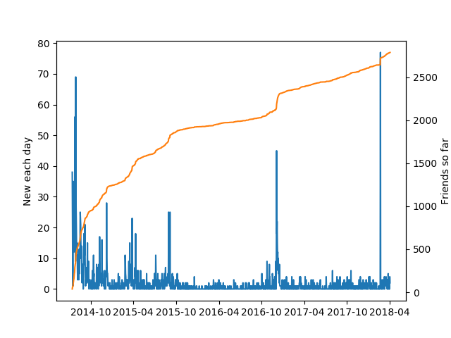
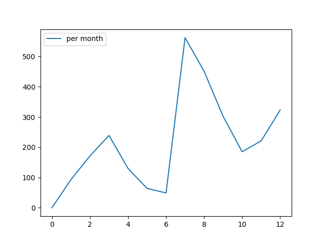
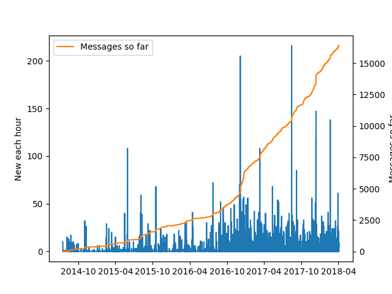
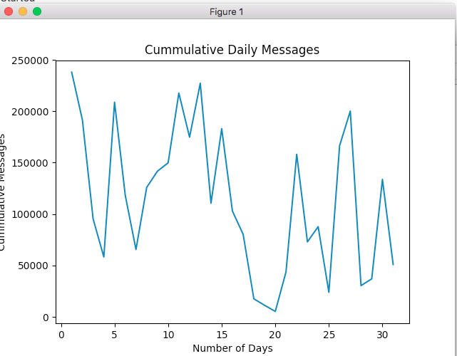
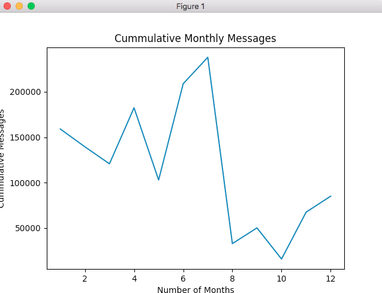
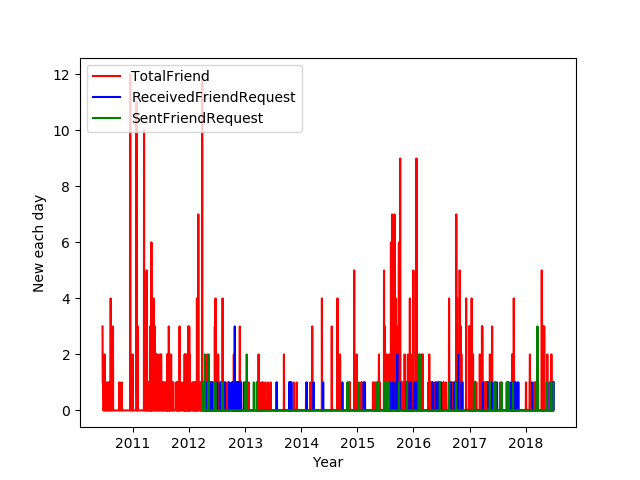
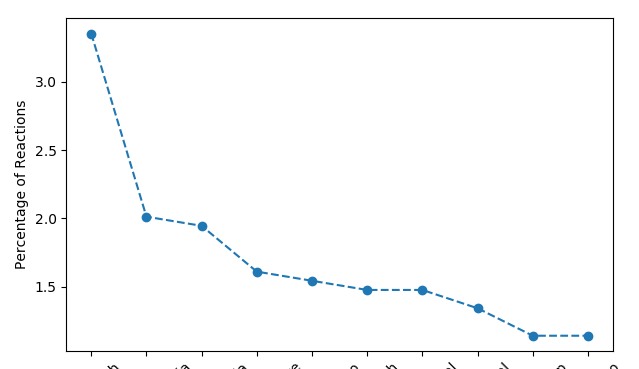
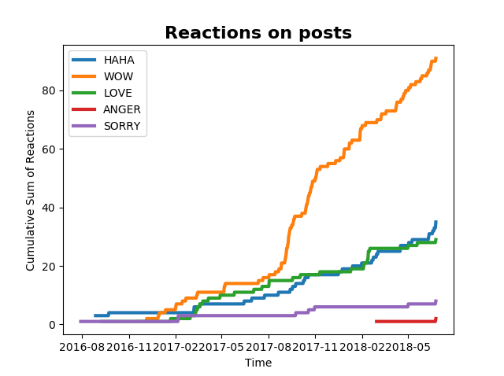
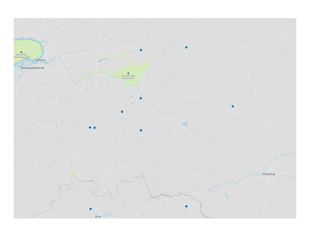

# facebook-archive
[](http://forthebadge.com) [](https://forthebadge.com)

[](https://girlscriptgssoc.slack.com/messages/CB4V6N62H/details/)

[](http://makeapullrequest.com) [](https://opensource.org/licenses/mit-license.php) 


 


> Analyse everything facebook knows about you, through their own archive.

In light of the recent facebook's data breach, Mark Zuckerberg made all the data available for each user via Facebook. You're going to need to download it, we'll get to it shortly. There are some things that would take a lot of time (too costly API calls) online, but can be easily done on archived data.

Note to KWoC contributors: All issues are available for KWoC, feel free to work on any issue after being assigned.


## Table of Contents

- [facebook-archive](#facebook-archive)
  - [Table of Contents](#table-of-contents)
  - [Getting the data](#getting-the-data)
  - [Usage](#usage)
    - [Friends](#friends)
    - [Messages](#messages)
    - [Locations](#locations)
  - [Contributing](#contributing)
  - [Features](#features)
    - [Your friends](#your-friends)
    - [Your Messages](#your-messages)
    - [Friend Request](#friend-request)
    - [Your reactions](#your-reactions)
    - [Your posts and comments](#your-posts-and-comments)
    - [Your locations](#your-locations)
  - [Observations](#observations)
  - [Why](#why)
  - [License](#license)

## Getting the data

1. Head on to [Facebook > Settings > General Settings > Your facebook information](https://www.facebook.com/settings?tab=your_facebook_informations).
2. Select the JSON data format and click on download archive. It might take some time to prepare the archive, this might take upto 10-15 minutes. NOTE: The download might be in order of 100s MBs. Disable photo and video download options to save some bandwidth. (My archive was ~300MB).
3. If possible, download the same data in HTML format. It is much easier to browse through your archive and spot some interesting patterns in the HTML format, however this is not necessary. The JSON format will suffice for processing, refer [#2](https://github.com/kaustubhhiware/facebook-archive/issues/2).
 
 
[↥ back to top](#table-of-contents)

## Usage

Install requirements with `pip install -r requirements.txt`

### Friends

```
> python plot_friends.py
Enter facebook archive extracted location: <location of extracted data folder,  e.g.: "facebook-kaustubhhiware">
```
You can also run the script on sample data included in the examples folder:
```python
> python plot_friends.py
Enter facebook archive extracted location: ./examples
```
[↥ back to top](#table-of-contents)

### Messages

**Will be updated soon**

* Plot messages across all conversations.
 ```
 > python plot_messages.py -a
 Enter facebook archive extracted location: "location of extracted, downloaded zip: like facebook-kaustubhhiware" 
 ```

* Plot messages for a single conversation.
 ```
 > python plot_messages.py
 Enter facebook archive extracted location: "location of extracted, downloaded zip: like facebook-kaustubhhiware"
 Enter id for friend: 511
 ```

What's this id? 
1. Open index.html in `facebook-yourfacebookusername`
2. Click messages. Search for the person / conversation you want to analyse.
3. Clicking on that chat should open a url like ; 'file:///home/kaustubh/GitHub/facebook-kaustubhhiware/messages/511.html'. For this particular chat, 511 is the id for this particular conversation.
[↥ back to top](#table-of-contents)

### Locations

**Will be updated soon**

* Plot your location history.
 ```
 > python where_have_you_been.py 
 Enter facebook archive extracted location: "location of extracted, downloaded zip: like facebook-kaustubhhiware" 
 ```
 [↥ back to top](#table-of-contents)

## Contributing

Your contributions are always welcome :smile: ! Please have a look at the [contribution guidelines](CONTRIBUTING.md) first.

Before working on an issue / feature, it is **crucial** that you're assigned the task on a GitHub issue.
* If a relevant issue already exists, discuss on the issue and get yourself assigned on GitHub.
* If no relevant issue exists, open a new issue and get it assigned to yourself on GitHub.
Please proceed with a Pull Request only after you're assigned. It'd be a waste of your time as well as ours if you have not contacted us before hand when working on some feature / issue.

If you are here for GirlScript's Summer of Code and wish to seek assistance, feel free to contact any of the mentors on [slack](https://girlscriptgssoc.slack.com/) - 
[@kaustubhhiware](https://girlscriptgssoc.slack.com/messages/DB0B3GBEG/), [@techytushar](https://girlscriptgssoc.slack.com/messages/DBBGEQAPQ/),
[@Anubhav](https://girlscriptgssoc.slack.com/messages/DBAK57AQ2/), [@fhackdroid](https://girlscriptgssoc.slack.com/messages/DBAK4TUP4/), [@Roopal](https://girlscriptgssoc.slack.com/messages/DB92S68SX).

[↥ back to top](#table-of-contents)

## Features

(Click to expand)

### Your friends

Plot the friends you make every day (blue), and the friends so far (orange).

 

<details>
<summary>Plot exclusively the friends you make each day.</summary>

 
</details>

<details>
<summary>Plot messages as a function of month.</summary>

 
</details>

[↥ back to top](#table-of-contents)


### Your Messages

The following is available for either a specific chat (person / group) or for all messages.

Plot all messages so far,

 

<details>
<summary>Plot daily message frequency</summary>

 
</details>
<details>
<summary>Plot monthly message frequency</summary>

 
</details>
<details>
<summary>Plot yearly message frequency</summary>

 
</details>

[↥ back to top](#table-of-contents)
### Top_10_friends_whom_I_message and Top_10_friends_who_message_me
Find the top ten friends whom you message and plot each friends no. of messages as a function of time
https://github.com/hadesanirban/facebook-archive/tree/master/images/Top_10_Friends_whom_I_message
* Plot Top_ten_Friends.
 ```
 > python plot Top_ten_Friends.py --num_friends 7 (for example)
 enter your official facebook name: "your name as in facebook i.e. Anirban Panda"
 Enter facebook archive extracted location: "location of extracted, downloaded zip: like facebook-kaustubhhiware"
 ```
 Also added a new command line argument named num_friends which helps you to plot as many friends as you want but default value is set to 10.

### Friend Request
Plot the friends you make every day(Red) ,friend request send every day(green) and friend request received every day(blue)



 <details>
  <summary>We compare monthwise no.of friend request send vs friend request received</summary>

  
  </details>

### Your reactions

Plot count of different reactions to posts

 

<details>
<summary>Plot of 10 Friends whose posts you react to the most</summary>

 
</details>
<details>
<summary>Plot reactions as a function of month.</summary>

 
</details>
<details>
<summary>Plot cumulative count of different reactions on a single plot</summary>

 
</details>

[↥ back to top](#table-of-contents)

### Your posts and comments

Wordcloud of common words in your posts and comments

 

<details>
<summary>Most tagged friends in your post</summary>

 
</details>

### Your Locations

Plot all locations so far,

 

[↥ back to top](#table-of-contents)


## Observations


1. There is a spike in friends made in March (Election season) and July (new juniors, much higher spike).

2. I tend to message less during exams (Feb, Apr, Sep, Nov).

3. Highest number of messages sent at 9 and 11 pm, confirming with calls from home come at 10pm. Almost no messages shared between 3am-7am.

4. I used to send more friend request as compared to friend request received.
 	 
5. I tend to receive more friend request in the month of july,august(new juniors)

[↥ back to top](#table-of-contents)

## Why

I always wanted to know how many friends I make every month. It would have been infeasible to make a webapp out of this because so many API calls would be so _slow_, and whosoever wants to work with Facebook's Graph API?

Plus it was raining and I couldn't go to MS's Hall Day till after the rain stopped.

Have a feature request? See an interesting avenue not utilised yet with facebook's archive? Let me know by making a new issue.

[↥ back to top](#table-of-contents)

## License

The MIT License (MIT) 2018 - [Kaustubh Hiware](https://github.com/kaustubhhiware). Please have a look at the [LICENSE](LICENSE) for more details.
